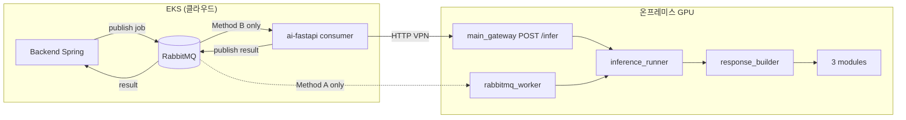
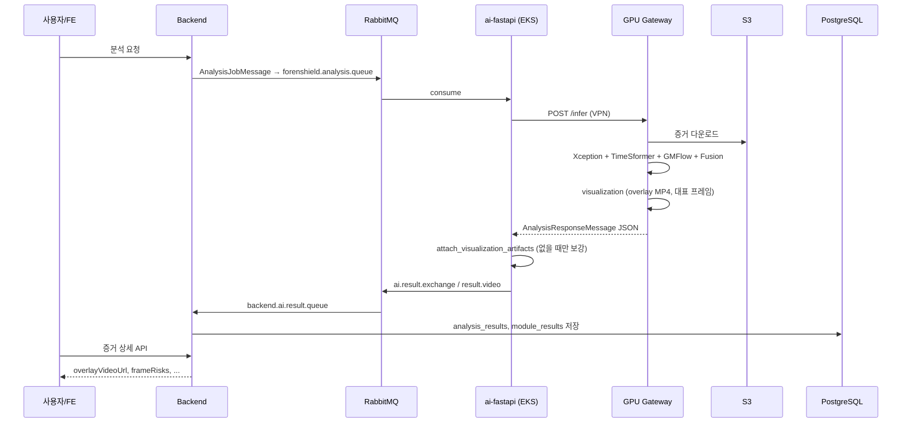

# GPU Worker 완전 가이드

> **대상 독자:** ForenShield AI 파이프라인을 처음 보는 개발자  
> **코드 위치:** `ai-forensic/gpu_worker/`  
> **관련 문서:** `Infra/md/gpu-method-b-3module-pipeline-2026-07-07.md`, `Infra/md/gpu-worker-e2e-xception.md`, `backend-forensic/docs/integrations/ai-json.md`

---

## 1. 한 줄로 정리하면

**`gpu_worker`는 온프레미스 GPU 서버에서 영상 딥페이크 분석을 실행하고, 백엔드가 이해할 수 있는 JSON(`AnalysisResponseMessage`)을 만드는 Python 패키지입니다.**

- RabbitMQ에서 작업을 직접 받을 수도 있고 (**Method A**)
- EKS `ai-fastapi`가 HTTP로 `/infer`만 호출하게 할 수도 있습니다 (**Method B — 현재 운영**)

핵심은 **“GPU에서 무거운 PyTorch 추론 + 3모듈 Late Fusion + 시각화 산출물(대표 프레임·오버레이 MP4)”** 을 수행한다는 점입니다.

---

## 2. ForenShield 분석 파이프라인 전체 그림

### 2.1 시스템 구성요소

| 구성요소 | 위치 | 역할 |
|---------|------|------|
| **Backend (Spring)** | EKS `forenshield` | 분석 요청 생성, RabbitMQ에 job publish, result consume → PostgreSQL 저장 |
| **RabbitMQ** | EKS | `forenshield.analysis.queue` (job), `ai.result.exchange` → `backend.ai.result.queue` (result) |
| **ai-fastapi (consumer)** | EKS Pod | Method B: queue consume → GPU Gateway HTTP 호출 → result publish |
| **GPU Gateway** | 온프레미스 RTX 서버 | `POST /infer` — 실제 `gpu_worker` 추론 실행 |
| **gpu_worker** | GPU 서버 (코드) | 추론·fusion·JSON 조립 라이브러리 + (선택) RabbitMQ worker |
| **S3** | AWS | 증거 원본·분석 산출물(overlay MP4, 대표 프레임 JPG) 저장 |

### 2.2 Method A vs Method B

ForenShield는 같은 `gpu_worker` 코드를 **두 가지 배치 방식**으로 씁니다.

| | **Method A (레거시/PoC)** | **Method B (현재 운영)** |
|---|---------------------------|-------------------------|
| **RabbitMQ consumer** | GPU: `python -m gpu_worker.rabbitmq_worker` | EKS: `app/consumer.py` (`AnalysisConsumer`) |
| **추론 실행** | GPU 프로세스 안에서 직접 | EKS → VPN → GPU `POST /infer` |
| **결과 publish** | `gpu_worker.rabbitmq_worker` | `app/consumer.py` |
| **GPU에서 RabbitMQ** | 필요 (VPN → NodePort) | **불필요** — HTTP `:8000`만 열면 됨 |
| **Gateway 앱** | 없어도 됨 | `uvicorn app.main_gateway:app` |
| **동시 실행** | ❌ **절대 금지** — consumer 2개가 job을 나눠 먹음 |



### 2.3 Method B 상세 시퀀스 (운영 기준)



---

## 3. `gpu_worker` 디렉터리 구조

현재 저장소에 실제로 존재하는 파일만 나열합니다.

```
ai-forensic/
├── gpu_worker/
│   ├── .env                      # GPU 서버 전용 환경변수 (git 제외 권장)
│   ├── config.py                   # WorkerConfig — 모든 설정의 단일 진입점
│   ├── schemas.py                  # RabbitMQ job/result Pydantic 스키마
│   ├── rabbitmq_worker.py          # Method A: RabbitMQ consumer 메인
│   ├── inference_runner.py         # 추론 모드 라우터 (test / gateway / local_model)
│   ├── s3_download.py              # S3·presigned URL 증거 다운로드
│   ├── models/
│   │   └── xception_video.py       # 레거시 단독 Xception 경로 (3모듈과 별개)
│   └── pipeline/
│       ├── paths.py                # deepfake infer 스크립트 import path 설정
│       ├── module_infer.py         # Xception / TimeSformer / GMFlow 실행
│       ├── fusion.py               # Late Fusion (v4 gated 등)
│       ├── segments.py             # 고위험 시간 구간(suspiciousSegments) 생성
│       └── response_builder.py     # ★ 3모듈 오케스트레이터 + BE JSON 조립
│
├── app/                            # ai-fastapi (EKS) + GPU Gateway
│   ├── consumer.py                 # Method B RabbitMQ consumer (EKS)
│   ├── gpu_client.py               # EKS → GPU /infer HTTP 클라이언트
│   ├── main_gateway.py             # GPU Gateway FastAPI 앱 (RabbitMQ 없음)
│   ├── routers/infer.py            # POST /infer 엔드포인트
│   └── services/
│       ├── gateway_infer.py        # /infer → gpu_worker 연결 어댑터
│       ├── visualization_artifacts.py  # 대표 프레임·오버레이 MP4 생성
│       └── response_visualization.py   # EKS 측 시각화 보강 (fallback)
│
├── config/
│   └── fusion_v4_ts_gated.json     # Late Fusion 규칙 (가중치·게이팅·임계값)
│
└── deepfake/scripts/infer/         # 실제 PyTorch 추론 스크립트 (gpu_worker가 import)
    ├── video_xception_infer.py
    ├── video_timesformer_infer.py
    ├── gmflow_learned_head_infer.py
    └── ...
```

**문서에만 있고 저장소에 없는 것 (주의):**
- `gpu_worker/run_offline.py`
- `gpu_worker/fixtures/sample_job.json`
- `gpu_worker/models/xception_ffpp_net.py` (`xception_video.py`가 import하지만 3모듈 경로는 `video_xception_infer.py` 사용)

---

## 4. 파일별 상세 설명

### 4.1 `config.py` — 설정의 중심

**역할:** `gpu_worker/.env`를 읽어 `WorkerConfig` dataclass를 만듭니다. GPU Gateway와 Method A worker 모두 이 설정을 공유합니다.

| 필드 / 환경변수 | 의미 |
|----------------|------|
| `RABBITMQ_HOST`, `PORT`, `USER`, `PASSWORD`, `VHOST` | Method A에서 EKS RabbitMQ NodePort 접속 |
| `analysis_queue` | 하드코딩 `forenshield.analysis.queue` (BE와 동일) |
| `AI_RESULT_EXCHANGE`, `AI_RESULT_ROUTING_KEY` | 결과 publish 대상 (`ai.result.exchange` / `result.video`) |
| `FORENSHIELD_AI_ROOT` | 프로젝트 루트 (`work/`, `results/` 생성) |
| `DEEPFAKE_ROOT` | `deepfake/` 모델·스크립트 루트 |
| `INFERENCE_MODE` | `test` \| `gateway` \| `local_model` |
| `USE_MOCK_INFER` | `1`이면 실모델 대신 해시 기반 가짜 점수 |
| `INFER_DEVICE` / `INFERENCE_DEVICE` | `cuda` / `cpu` |
| `XCEPTION_WEIGHTS`, `TIMESFORMER_WEIGHTS`, `GMFLOW_*` | 각 모듈 weight 경로 |
| `FUSION_CONFIG_PATH` | 기본 `config/fusion_v4_ts_gated.json` |
| `AI_GATEWAY_URL` | `gateway` 모드에서 HTTP 호출 대상 |

`load_config()`는 `work/`, `results/`, `results/infer/` 디렉터리를 자동 생성합니다.

---

### 4.2 `schemas.py` — 백엔드와의 JSON 계약

**역할:** RabbitMQ로 오가는 메시지 형태를 Pydantic으로 정의합니다. `app/schemas/messaging.py`와 거의 동일하며, `backend-forensic/docs/integrations/ai-json.md`와 맞춰야 합니다.

#### 주요 타입

| 타입 | 방향 | 설명 |
|------|------|------|
| `AnalysisJobMessage` | BE → AI | 분석 작업. `analysisRequestId`, `evidenceId`, S3 경로, presigned URL 등 |
| `AnalysisResponseMessage` | AI → BE | 최종 결과. `status`, `riskScore`, `results[]`, `modelScores[]` |
| `AnalysisVideoResultItem` | 응답 내부 | 영상 1건 분석. `frameRisks`, `clipRisks`, `pairRisks`, `moduleTimelines`, `overlayVideoUrl` |
| `FrameRiskItem` | Xception 출력 | 프레임별 fake 확률 (0~1) |
| `ClipRiskItem` | TimeSformer 출력 | 클립(연속 프레임 묶음)별 위험도 |
| `PairRiskItem` | GMFlow 출력 | 연속 프레임쌍 optical flow 이상 |
| `ModuleTimelineItem` | UI 차트용 | 모듈별 전체 타임라인 묶음 |
| `ModelScoreItem` | UI 카드용 | fusion + cnn + temporal + optical 4개 점수 |
| `RepresentativeFrameItem` | UI 썸네일 | 대표 프레임 시간·점수·`imageUrl` |

---

### 4.3 `rabbitmq_worker.py` — Method A 진입점

**역할:** GPU 서버에서 RabbitMQ를 **직접** consume하는 standalone worker입니다.

**실행:**
```bash
cd ~/forenShield-ai   # FORENSHIELD_AI_ROOT
python -m gpu_worker.rabbitmq_worker
```

**처리 흐름 (`process_job`):**
1. `AnalysisJobMessage` JSON 파싱
2. `s3_download.download_job_file()` — presigned URL 우선, 없으면 boto3 S3
3. `inference_runner.run_inference()` — `INFERENCE_MODE`에 따라 분기
4. `publish_result()` — `ai.result.exchange`로 JSON publish
5. 실패 시 `status=FAILED`, `errorCode=MODEL_INFERENCE_FAILED`

**특징:**
- `queue_declare(durable=True)` — 큐를 **생성**함 (BE가 만든 DLX 큐와 충돌 가능)
- Method B 운영 시 **반드시 중지**: `pkill -f gpu_worker.rabbitmq_worker`

---

### 4.4 `inference_runner.py` — 추론 모드 스위치

**역할:** 모든 추론 요청의 **라우터**. Gateway·RabbitMQ worker 모두 여기로 모입니다.

```
run_inference(job, local_path, cfg)
    ├── INFERENCE_MODE=gateway  → run_gateway_inference()   # 다른 HTTP 서버에 위임 (테스트용)
    ├── INFERENCE_MODE=local_model → run_local_model_inference()  # ★ 운영 GPU 경로
    └── 그 외                    → run_test_inference()     # 해시 기반 가짜 5모듈 점수
```

#### `run_test_inference`
- DB/모델 없이 E2E 연결 테스트용
- `originalSha256` 해시로 재현 가능한 5모듈 점수 생성 (lipSync, frameEdit, deepfake, splicing, reEncoding)
- 결과 JSON을 `results/analysis_{requestId}_{evidenceId}.json`에 저장

#### `run_gateway_inference`
- `AI_GATEWAY_URL/infer`에 HTTP POST (자기 자신을 호출하는 circular 테스트용)
- 5모듈 legacy 응답 파싱

#### `run_local_model_inference` ★ **운영 핵심**
- `USE_MOCK_INFER=1`이면 test로 fallback
- `gpu_worker.pipeline.response_builder.build_analysis_response()` 호출
- 3모듈 + Late Fusion + 시각화 산출물이 포함된 **완전한 BE 계약 JSON** 반환
- 결과 JSON을 `results/`에 저장

---

### 4.5 `s3_download.py` — 증거 파일 가져오기

| 함수 | 호출자 | 설명 |
|------|--------|------|
| `download_job_file(job, cfg)` | `rabbitmq_worker` | RabbitMQ job 기준. presigned → S3 → 에러 |
| `download_from_evidence_path(path, cfg, dest)` | `gateway_infer` | `s3://`, `https://`, 로컬 파일 경로 지원 |
| `parse_s3_uri(uri)` | 공통 | `s3://bucket/key` 파싱 |

로컬 저장 경로: `{work_dir}/{evidenceId}_{analysisRequestId}.mp4`

---

### 4.6 `pipeline/` — 3모듈 분석 엔진

#### `paths.py`
- `setup_script_paths()`: `deepfake/scripts/infer`를 `sys.path`에 추가 → `video_xception_infer` 등 import 가능
- `resolve_under_root()`: 상대 경로를 `FORENSHIELD_AI_ROOT` / `DEEPFAKE_ROOT` 기준으로 절대 경로화

#### `module_infer.py` — 모듈별 추론

각 모듈은 `ModuleRunResult` dataclass로 통일된 형태를 반환합니다.

| 함수 | 모듈 키 | 사용 스크립트 | 출력 타임라인 |
|------|---------|--------------|--------------|
| `run_xception_module()` | `cnn` | `video_xception_infer.infer_video` | `frameRisks[]`, `suspiciousSegments[]` |
| `run_timesformer_module()` | `temporal` | `video_timesformer_infer` + clip common | `clipRisks[]`, `temporalSuspiciousSegments[]` |
| `run_gmflow_module()` | `optical` | `optical_flow_infer_model` + learned head | `pairRisks[]`, `opticalSuspiciousSegments[]` |

**공통 처리:**
- OpenCV로 FPS 측정 → `timestampSec = frameIndex / fps`
- CUDA 사용 가능 시 GPU, 아니면 CPU
- 얼굴 검출: Haar cascade (Xception/TimeSformer), YuNet은 visualization 쪽

#### `segments.py`
- 프레임/클립/페어 점수 리스트에서 **연속 고위험 구간**을 `SuspiciousSegmentItem` 리스트로 변환
- `min_duration_sec` 미만 구간은 버림

#### `fusion.py` — Late Fusion

`config/fusion_v4_ts_gated.json`을 읽어 3모듈 점수를 하나의 `fusion.score`로 합칩니다.

지원 `method`:
- `logistic` / `logistic_gated` — 로지스틱 회귀 계수 + 시그모이드
- `gated` — v4 TS-gated 규칙 (`_apply_v4_ts_gated`): CNN ambiguous 구간에서 TimeSformer rescue, GMFlow veto 등
- `weighted_avg` — 단순 가중 평균

출력 `FusionResult`:
- `score` (0~1), `detected`, `confidence`, `risk_score` (0~100), `risk_level`, `reasons[]`

#### `response_builder.py` ★ **가장 중요한 파일**

**역할:** 3모듈 파이프라인 전체를 orchestration하고, 백엔드가 DB에 저장할 `AnalysisResponseMessage`를 조립합니다.

**`build_analysis_response()` 단계:**

```
1. fusion_v4_ts_gated.json 로드
2. run_xception_module()      → CNN frameRisks
3. run_timesformer_module()   → temporal clipRisks
4. run_gmflow_module()        → optical pairRisks
5. apply_late_fusion()        → 최종 deepfakeScore, riskScore
6. _build_model_scores()      → UI용 4개 ModelScoreItem
7. _build_module_timelines()  → moduleTimelines[] (cnn/temporal/optical)
8. build_visualization_artifacts()  → 대표 프레임 JPG, overlay MP4, S3 URL
9. AnalysisVideoResultItem + AnalysisResponseMessage 조립
```

**시각화 연동:**
- CNN `frameRisks`를 `per_frame_scores`로 변환
- 프레임 리스크가 없으면 영상 전체 점수로 coarse fallback
- `app.services.visualization_artifacts.build_visualization_artifacts()` 호출
- 성공 시 `representativeFrames`, `overlayVideoUrl`이 응답에 포함

---

### 4.7 `models/xception_video.py` — 레거시 단독 Xception

**역할:** 초기 PoC용 자체 Xception 추론기. **현재 3모듈 운영 경로에서는 사용하지 않습니다.**

- `run_xception_video()`, `XceptionVideoResult` — 독립 실행·JSON 저장
- `xception_ffpp_net` import — **파일이 repo에 없어** 이 경로 단독 실행은 깨질 수 있음
- 운영은 `module_infer.run_xception_module()` → `deepfake/scripts/infer/video_xception_infer.py` 사용

---

## 5. `app/`과의 관계 (gpu_worker를 누가 호출하는가)

`gpu_worker`는 **라이브러리**이고, 실제로는 `app/` 쪽 entry point가 실행 환경을 결정합니다.

| 파일 | 실행 위치 | gpu_worker 사용 |
|------|----------|----------------|
| `app/main_gateway.py` | GPU 서버 | `/infer` → `gateway_infer` → `run_inference` |
| `app/services/gateway_infer.py` | GPU 서버 | job 변환 + S3 다운로드 + `run_inference` |
| `app/routers/infer.py` | GPU 서버 | HTTP 핸들러 |
| `app/consumer.py` | EKS | RabbitMQ consume → `gpu_client.call_gpu_gateway` (HTTP만) |
| `app/gpu_client.py` | EKS | `AI_GATEWAY_URL/infer` POST, 응답을 `AnalysisResponseMessage`로 파싱 |
| `gpu_worker/rabbitmq_worker.py` | GPU (Method A) | 직접 consume + `run_inference` |

### EKS consumer의 시각화 2중 처리

```
GPU response_builder  → 이미 overlayVideoUrl 포함 가능
         ↓
EKS consumer.attach_visualization_artifacts()
         ↓
overlay/representativeFrames 없으면 EKS에서 S3 재다운로드 후 visualization 재생성
```

운영 GPU에서 `local_model` + visualization이 정상이면 EKS 보강은 **스킵**됩니다.

---

## 6. 백엔드(RabbitMQ) 연동

### 6.1 Job publish (Backend → AI)

큐: `forenshield.analysis.queue`  
Spring: `RabbitMqAnalysisJobEnqueuer`  
메시지: `AnalysisJobMessage` (Java) ≈ `gpu_worker/schemas.py`

```json
{
  "analysisRequestId": 161,
  "evidenceId": 158,
  "fileType": "video",
  "filePath": "deepfake/evidence/.../video.mp4",
  "s3Bucket": "forenshield-evidence-877044078824",
  "s3ObjectKey": "deepfake/evidence/.../video.mp4",
  "presignedDownloadUrl": "https://...",
  "originalHash": "sha256...",
  "caseName": "사건명"
}
```

### 6.2 Result publish (AI → Backend)

Exchange: `ai.result.exchange`  
Routing key: `result.video`  
Binding: `backend.ai.result.queue`  
Consumer: `RabbitMqAnalysisResultConsumer` (Spring)

성공 응답 핵심 필드:
```json
{
  "analysisRequestId": 161,
  "evidenceId": 158,
  "status": "COMPLETED",
  "riskScore": 72.5,
  "confidenceScore": 0.91,
  "riskLevel": "HIGH",
  "modelScores": [ /* fusion, cnn, temporal, optical */ ],
  "results": [{
    "deepfakeScore": 0.725,
    "frameRisks": [ /* Xception */ ],
    "clipRisks": [ /* TimeSformer */ ],
    "pairRisks": [ /* GMFlow */ ],
    "moduleTimelines": [ /* 3 modules */ ],
    "representativeFrames": [ /* S3 imageUrl */ ],
    "overlayVideoUrl": "https://.../overlay.mp4"
  }]
}
```

---

## 7. 3모듈이 각각 무엇을 보는가

| 모듈 | 모델 | 보는 것 | UI에서 쓰는 데이터 |
|------|------|---------|-------------------|
| **CNN (Xception)** | 공간적 얼굴·질감 | 프레임마다 fake 확률 | `frameRisks`, `suspiciousSegments`, 대표 프레임·오버레이 소스 |
| **Temporal (TimeSformer)** | 시간적 일관성 | 클립(연속 프레임) 단위 | `clipRisks`, `temporalSuspiciousSegments` |
| **Optical (GMFlow)** | 움직임 벡터 | 프레임쌍 flow 이상 | `pairRisks`, `opticalSuspiciousSegments` |
| **Fusion** | 규칙 기반 Late Fusion | 3점수 합산 + 게이팅 | `deepfakeScore`, `riskScore`, `modelScores[0]` |

Fusion 설정 예 (`config/fusion_v4_ts_gated.json`):
- `weights`: cnn 0.9, temporal 0.0, optical 0.1 (버전에 따라 다름)
- `gating`: CNN ambiguous일 때 TimeSformer rescue, GMFlow low일 때 CNN discount
- `module_thresholds`: 모듈별 detected 판정 임계값

---

## 8. 운영 실행 명령어

### Method B (권장)

**GPU 서버:**
```bash
cd ~/forenShield-ai
# gpu_worker/.env 에 INFERENCE_MODE=local_model, USE_MOCK_INFER=0
uvicorn app.main_gateway:app --host 0.0.0.0 --port 8000

# 레거시 worker는 반드시 중지
pkill -f gpu_worker.rabbitmq_worker || true
pgrep -af gpu_worker   # rabbitmq_worker 없어야 함
```

**EKS ai-fastapi:**
- `AI_CONSUMER_ENABLED=true`
- `AI_GATEWAY_URL=http://<GPU-private-IP>:8000` (VPN 경유)

**로그:**
```bash
# EKS
kubectl logs -n forenshield -l app=ai-fastapi --tail=200 -f

# GPU Gateway (systemd/nohup 사용 시 해당 로그 파일)
```

### Method A (레거시 — 운영과 병행 금지)

```bash
python -m gpu_worker.rabbitmq_worker
```

---

## 9. 디스크에 생기는 산출물

| 경로 | 생성 주체 | 내용 |
|------|----------|------|
| `{FORENSHIELD_AI_ROOT}/work/{evidenceId}_{analysisRequestId}.mp4` | s3_download | 다운로드된 증거 |
| `{FORENSHIELD_AI_ROOT}/work/visualization/{evidenceId}_{analysisRequestId}/` | visualization_artifacts | 프레임 JPG, overlay.mp4 (업로드 전) |
| `{FORENSHIELD_AI_ROOT}/results/analysis_{requestId}_{evidenceId}.json` | inference_runner | BE로 보낸 것과 동일한 응답 스냅샷 (디버깅) |
| S3 `deepfake/artifacts/analysis/{evidenceId}/{requestId}/` | visualization (업로드 시) | overlay.mp4, frame_XX.jpg |

---

## 10. 프로덕션 vs 개발/레거시 정리

| 구성요소 | Method B 운영 | 개발/레거시 |
|---------|--------------|------------|
| `pipeline/response_builder.py` | ✅ 핵심 | — |
| `pipeline/module_infer.py`, `fusion.py`, `segments.py` | ✅ | — |
| `inference_runner.run_local_model_inference` | ✅ (via Gateway) | — |
| `app/main_gateway.py`, `gateway_infer.py` | ✅ GPU | — |
| `app/consumer.py`, `gpu_client.py` | ✅ EKS | — |
| `gpu_worker/rabbitmq_worker.py` | ❌ 꺼둠 | Method A |
| `inference_runner.run_test_inference` | ❌ | `INFERENCE_MODE=test` |
| `models/xception_video.py` | ❌ | 실험용 |
| `POST /ai/analyze` | ❌ (queue E2E 아님) | REST 로컬 테스트 |

---

## 11. 자주 하는 실수 / 트러블슈팅

| 증상 | 원인 | 조치 |
|------|------|------|
| 분석이 절반만 처리됨 | Method A worker + EKS consumer 동시 실행 | GPU에서 `pkill -f gpu_worker.rabbitmq_worker` |
| `consumers=2` on analysis queue | 위와 동일 | worker 1개만 |
| Gateway 503 gpu_worker/torch | GPU에 torch 미설치 | venv + requirements 설치 |
| Xception weights not found | `.env` weight 경로 오류 | `XCEPTION_WEIGHTS` 절대경로 확인 |
| overlay 0:00 / ExpiredToken | S3 presigned 만료 (BE 이슈) | BE `VisualizationArtifactUrlRefresher` (별도) |
| visualization 없음 | 얼굴 미검출, OpenCV/YuNet 실패 | GPU 로그에서 `Visualization artifacts` 확인 |
| EKS만 재배포해도 됨? | UI/BE API 변경 | ✅ 기존 증거 재분석 불필요 |
| AI도 재배포? | 새 분석부터 heatmap 제거 등 | ✅ `ai-forensic` main 배포 또는 workflow_dispatch |

---

## 12. 코드 읽는 추천 순서

처음 `gpu_worker`를 이해할 때 아래 순서로 읽으면 전체가 연결됩니다.

1. `schemas.py` — BE와 주고받는 JSON 형태
2. `config.py` — 환경변수
3. `inference_runner.py` — `run_inference` 분기
4. `pipeline/response_builder.py` — 3모듈 + fusion + visualization
5. `pipeline/module_infer.py` — 각 모델이 실제로 호출하는 deepfake 스크립트
6. `app/services/gateway_infer.py` — HTTP `/infer` 어댑터
7. `app/consumer.py` — EKS에서 GPU를 부르는 쪽
8. `gpu_worker/rabbitmq_worker.py` — (참고) Method A 단독 경로

---

## 13. 한 페이지 요약

```
[사용자] → Backend → RabbitMQ job
                ↓
         EKS ai-fastapi (consumer)
                ↓ HTTP /infer
         GPU Gateway (main_gateway)
                ↓
         gpu_worker.inference_runner (local_model)
                ↓
         gpu_worker.pipeline.response_builder
           ├─ Xception  → frameRisks
           ├─ TimeSformer → clipRisks
           ├─ GMFlow → pairRisks
           ├─ fusion → riskScore
           └─ visualization_artifacts → overlay MP4, 대표 프레임
                ↓
         AnalysisResponseMessage JSON
                ↓
         RabbitMQ result → Backend → PostgreSQL → Frontend
```

**`gpu_worker` = GPU에서 돌아가는 “분석 엔진 + BE JSON 조립기”**  
**`app/consumer` = 클라우드에서 GPU를 원격 호출하는 “오케스트레이터”**  
**`rabbitmq_worker` = 예전에 GPU가 큐까지 직접 먹던 방식 (지금은 끄기)**

---

*문서 기준: `ai-forensic` develop 브랜치 코드 스냅샷 (2026-07-10)*
