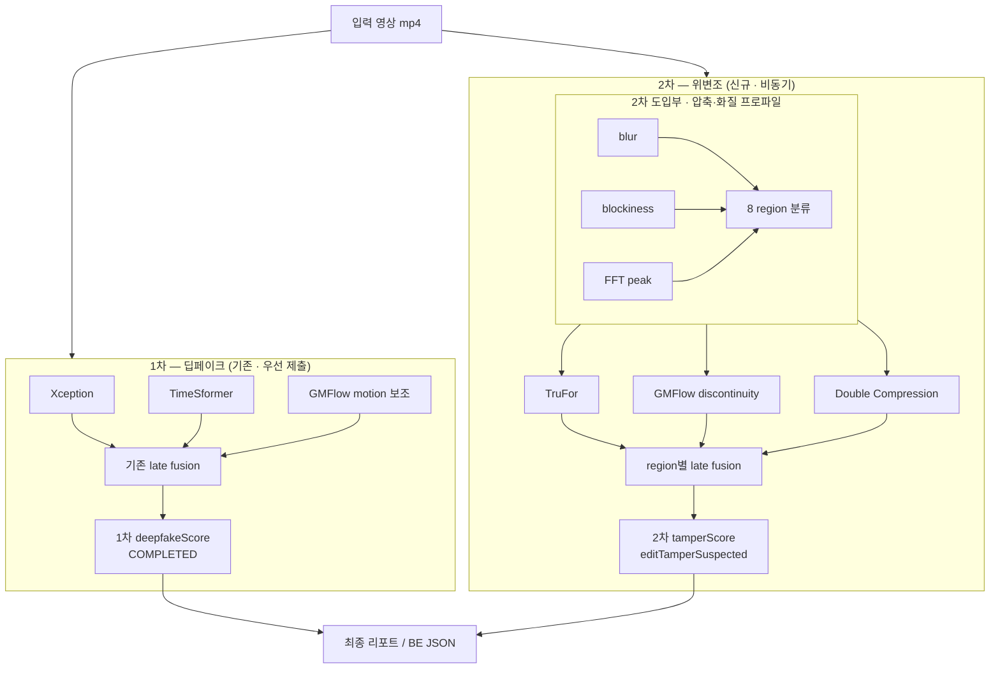

# ForenShield 영상 분석 파이프라인 — 1차 딥페이크(기존) · 2차 위변조 + 압축 프로파일

> **작성 기준일:** 2026-06-23  
> **상태:** 설계 확정(팀 공유용) · 2차·프로파일은 신규 구현  
> **관련:** [VIDEO_DEEPFAKE_MODEL_BENCHMARK_3x3.md](./VIDEO_DEEPFAKE_MODEL_BENCHMARK_3x3.md) · [GMFLOW_DEEPFAKE_SCORE.md](./GMFLOW_DEEPFAKE_SCORE.md) · BE [ai-json.md](../../backend/docs/integrations/ai-json.md)

---

## 0. 한 줄 요약 (팀 합의)

- **1차 딥페이크:** **이미 구현·운영 중** — Xception + TimeSformer + GMFlow, **기존 fusion/threshold 그대로** → 결과 **우선 제출**
- **2차 위변조:** **신규 도입** — 파이프라인 **입구**에서 **압축·화질 프로파일**(blur / blockiness / FFT peak) → **8 region** → region별로 TruFor · GMFlow(컷) · Double Compression **가중치·late fusion**을 달리 적용

압축 프로파일은 **1차에 넣지 않습니다.** **2차 도입부 전용**입니다.

---

## 1. 왜 2단계로 나누는가

| 구분 | 질문 | 담당 | 모델 | 프로파일 |
|------|------|------|------|----------|
| **1차** | 사람·신체가 **AI로 합성/교체**됐는가? | 딥페이크 (기존) | Xception, TimeSformer, GMFlow | **없음 (현행 유지)** |
| **2차** | **편집·재압축·국소 조작** 흔적이 있는가? | 위변조 (신규) | TruFor, GMFlow(컷), Double Compression | **blur / blockiness / FFT → 8 region** |
| **3차** (BE) | 업로드 이후 **파일 무결성** | 체인·해시 | SHA-256, CoC, 블록체인 | — |

**운영 순서**

1. 1차 파이프라인 실행 → `deepfakeScore` 등 **COMPLETED 제출**
2. 2차 파이프라인 실행 (비동기) → tamper 필드 **갱신/추가**

---

## 2. 전체 파이프라인



---

## 3. 1차 — 딥페이크 (기존, 변경 없음)

### 3.1 모델·전처리

| 모델 | 축 | 비고 |
|------|-----|------|
| **Xception** | Spatial | Haar 얼굴 crop, 32프레임, `fake_score` |
| **TimeSformer** | Temporal | 얼굴 clip 8프레임, `fake_score` |
| **GMFlow** | Optical | motion anomaly **보조** |

상세: [VIDEO_DEEPFAKE_MODEL_BENCHMARK_3x3.md](./VIDEO_DEEPFAKE_MODEL_BENCHMARK_3x3.md)

### 3.2 fusion

- **현재 벤치/운영과 동일** (고정 가중치 또는 기존에 정한 1차 fusion 규칙)
- **압축 region 미사용** — blur / blockiness / FFT peak 계산 **하지 않음**

### 3.3 1차 산출물

| 필드 | 설명 |
|------|------|
| `deepfakeScore` | 1차 통합 점수 |
| `deepfakeDetected` | fake/real 판정 |
| `confidenceScore` | 1차 신뢰도 (기존 정의) |

→ **먼저 BE/UI에 제출**

---

## 4. 2차 도입부 — 압축·화질 프로파일 (8 region)

2차 위변조 **시작 단계**에서만 수행합니다. 목적은 영상을 **압축·화질 archetype**으로 나눈 뒤, **2차 모듈 fusion·threshold**를 region마다 다르게 쓰는 것입니다.

### 4.1 목적

| 하지 않는 것 | 하는 것 |
|--------------|---------|
| 압축 영상 **reject** | 2차 모듈 **가중치·threshold·신뢰도** 조정 |
| 1차 딥페이크 입력/점수 변경 | TruFor / GMFlow(2차) / DC **late fusion 라우팅** |

SNS·CCTV 증거는 대부분 이미 압축되어 있으므로 **걸러내지 않고** 2차 해석만 조정합니다.

### 4.2 측정 지표 (3종)

| 지표 | 의미 (요약) | 2차 해석 |
|------|-------------|----------|
| **blur** | 흐림·다운스케일 | TruFor texture·heatmap **신뢰도** |
| **blockiness** | DCT 블록·양자화 | **Double Compression**·재인코딩 연관 |
| **FFT peak** | 주기적 주파수 peak | 압축 grid / 리샘플 **아티팩트** |

각 지표 **High(H) / Low(L)** → **2³ = 8 region**

측정 단위: 영상 **전역** 또는 **구간(segment)** (컷 편집 대응 시 구간 권장)

### 4.3 8 region 정의

`region_id = (blur, blockiness, fft_peak)`

| ID | blur | blockiness | FFT peak | 대표 상황 | 2차 모듈 영향 (개념) |
|----|------|------------|----------|-----------|----------------------|
| **R0** | L | L | L | 선명·압축 흔적 약 | TruFor **↑**, DC **↓** |
| **R1** | L | L | H | 선명 + 주기 peak | DC **↑** |
| **R2** | L | H | L | 선명 + 블록 | DC **↑** |
| **R3** | L | H | H | heavy compress | DC **↑↑**, threshold 보수 |
| **R4** | H | L | L | **blur↑ block↓ fft↓** (예시) | TruFor **↓**, GMFlow cut **↓** |
| **R5** | H | L | H | 흐림 + peak | DC·TruFor 혼합, flow **↓** |
| **R6** | H | H | L | 흐림 + 블록 | DC **↑**, TruFor **↓** |
| **R7** | H | H | H | 다중 아티팩트 | **confidence cap**, hard trigger 완화 |

### 4.4 Coarse bucket (MVP, 선택)

| Bucket | region | 용도 |
|--------|--------|------|
| **CLEAN** | R0, R1 | 2차 baseline weight |
| **COMPRESS** | R2, R3, R5 | DC weight **↑** |
| **BLUR** | R4, R6 | TruFor/flow weight **↓** |
| **HARD** | R7 | tamper confidence cap |

---

## 5. 2차 — 위변조 모듈 + region fusion

프로파일(§4) 이후 동일 영상에 대해 아래 모듈을 실행합니다.

### 5.1 모듈 역할

| 모듈 | 보는 것 | 잡는 위조 |
|------|---------|-----------|
| **TruFor** | 픽셀·노이즈·heatmap | 스플라이스, 인페인팅, 국소 붙여넣기 |
| **GMFlow** | motion **불연속** | 컷, 장면 이음 (1차 motion anomaly와 **별도 점수**) |
| **Double Compression** | 재압축 흔적 | `reEncodingScore`, 이중 JPEG/H.264 |

> blockiness/FFT는 **프로파일(라우팅)** + DC **입력 특성**으로 역할을 나눕니다. fusion에서 **이중 가산**하지 않도록 weight 설계합니다.

### 5.2 region별 late fusion (2차 전용)

```
tamper_score(r) = w_tr(r)·score_trufor
                + w_fl(r)·score_gmflow_discontinuity
                + w_dc(r)·score_double_compression

editTamperSuspected = hard_trigger(r) OR tamper_score(r) >= threshold_2nd(r)
confidence_2nd(r)   = h(tamper_score, region_id)
```

**hard trigger 예 (region별 T 조정 가능):**

- TruFor `max_frame_score ≥ T_tr(r)`
- GMFlow `discontinuity ≥ T_fl(r)`
- DC `reencode_score ≥ T_dc(r)`

**가중치 원칙 (초안):**

| bucket / region | w_tr | w_fl | w_dc |
|-----------------|------|------|------|
| CLEAN (R0,R1) | **↑** | 보통 | ↓ |
| COMPRESS (R2,R3,R5) | 보통 | 보통 | **↑** |
| BLUR (R4,R6) | ↓ | **↓** | 보통 |
| HARD (R7) | ↓ | ↓ | **↑** (cap on final confidence) |

가중치·threshold는 dev set에서 튜닝 → `weights_2nd.yaml` (예정)

### 5.3 2차 산출물 (BE 갱신)

| 필드 | 설명 |
|------|------|
| `compressionRegionId` | R0~R7 (또는 coarse bucket) — **2차 전용** |
| `blur`, `blockiness`, `fftPeak` | 프로파일 raw / normalized |
| `editTamperDetected` | 위변조 의심 |
| `editTamperScore` | region-weighted tamper score |
| `reEncodingDetected` / `reEncodingScore` | DC |
| `frameEditDetected` | TruFor/GMFlow 집계 |
| `tamperHeatmapUri` | (선택) TruFor heatmap S3 |
| `analysisReasons` | “R3: blockiness↑ → DC weight ↑” 등 |

---

## 6. 1차 vs 2차 GMFlow

| | 1차 (기존) | 2차 (신규) |
|---|-----------|-----------|
| 엔진 | 동일 flow 추론 | 동일 |
| 점수 | `motion_anomaly_score` (fake 보조) | `discontinuity` (컷·이음) |
| 프로파일 | **미사용** | region별 w_fl |

---

## 7. 구현 로드맵

| Phase | 내용 | 산출 |
|-------|------|------|
| **P0** | 1차 (완료) | Xception + TimeSformer + GMFlow, 벤치·S3 |
| **P1** | 1차 BE 제출 | RabbitMQ 1차 COMPLETED (현행) |
| **P2** | 2차 도입부: blur / blockiness / FFT → 8 region | `compression_profile.json` |
| **P3** | TruFor + GMFlow(2차) + DC infer | 모듈별 score JSON |
| **P4** | region별 `weights_2nd.yaml` + late fusion | 2차 tamper API 갱신 |
| **P5** | 구간 단위 region + heatmap UX | 리포트 |

---

## 8. 데이터·검증

| 용도 | 데이터 |
|------|--------|
| 1차 (기존) | FF++, Vox, Celeb-DF |
| 2차 spatial | CASIA, TruFor 학습·pretrained |
| 2차 temporal | CSVTED, 자체 splice |
| 2차 DC | [DJPEG](https://huggingface.co/datasets/plok5308/djpeg_dataset) + ffmpeg 2-pass 합성 |
| **region weight (2차만)** | 위 dev set, region별 stratified eval |

---

## 9. 팀 FAQ

**Q. 압축 프로파일이 1차에도 들어가나?**  
A. **아니요.** 1차는 **기존 파이프라인 그대로**입니다.

**Q. 8 region은 어디에 쓰나?**  
A. **2차 위변조 fusion/threshold** 전용입니다.

**Q. 압축 영상을 버리나?**  
A. **아니요.** region으로 2차 가중치만 조정합니다.

**Q. 1차 fake + 2차 tamper 동시?**  
A. 가능. 리포트에서 **deepfake / edit** 근거를 **분리 표기**합니다.

---

## 10. 변경 이력

| 날짜 | 내용 |
|------|------|
| 2026-06-23 | 초안 — 2단계, 8 region (1차에도 프로파일 적용으로 기술) |
| 2026-06-23 | **수정** — 1차=기존 유지, **압축 프로파일=2차 도입부만** |

---

## 11. 다음 액션 (담당 TBD)

- [ ] blur / blockiness / FFT **계산 스펙** (2차 전용)
- [ ] H/L 임계값 · 8 region → 4 bucket 매핑
- [ ] `weights_2nd.yaml` 템플릿
- [ ] BE: `compressionRegionId` 등 **2차 필드**만 `ai-json.md` 반영
- [ ] 1차 COMPLETED → 2차 tamper **PATCH** RabbitMQ 시퀀스
