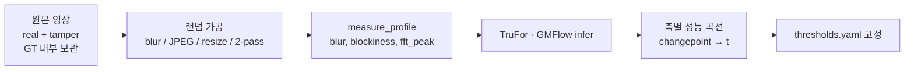

# 2차 압축 프로파일 — 지표 정의 · 임계값 보정 · region 합성

> **작성 기준일:** 2026-06-23  
> **상태:** 설계 확정(팀 공유용) · 스크립트는 P2 구현 예정  
> **관련:** [TAMPERING_DETECTION_PIPELINE.md](./TAMPERING_DETECTION_PIPELINE.md) · [GMFLOW_DEEPFAKE_SCORE.md](../deepfake/GMFLOW_DEEPFAKE_SCORE.md)

---

## 0. 한 줄 요약

- **blur / blockiness / fft_peak** 은 영상만으로 계산하는 **NR(무참조) 지표**이며, **tamper 라벨과 무관**하게 정의한다.
- **H/L 임계값(`t_blur`, `t_block`, `t_fft`)** 은 real 분포만으로 끝내지 않고, **내부 GT를 아는 eval set에 랜덤 가공 → TruFor·GMFlow 추론 → 성능 꺾임(changepoint)** 으로 정한다.
- **8 region** 은 위 3축의 H/L 조합이며, **region별 특화는 fusion 가중치(`weights_2nd.yaml`)** 로 한다. TruFor checkpoint 8개가 기본은 아니다.
- **데이터 합성**은 `thresholds.yaml`의 box(`t ± ε`) 안에서 랜덤 파라미터 + `measure_profile` 검증으로 만든다.

---

## 1. 이 문서가 다루는 것 / 다루지 않는 것

| 다룸 | 다루지 않음 |
|------|-------------|
| 지표 수식 초안, 정규화 | 1차 딥페이크 파이프라인 |
| `thresholds.yaml` 보정 절차 | TruFor 학습 레시피 전체 (→ 파이프라인 §8) |
| 랜덤 가공 eval set 구성 | `weights_2nd.yaml` grid 상세 (→ P4) |
| region 합성·manifest | DC 모듈 구현 (→ P3) |

---

## 2. 설계 원칙

### 2.1 지표 vs 모듈 eval 역할 분리

```
[고정] blur, blockiness, fft_peak 정의 (신호 처리)
         ↓
[보정] H/L 임계값 ← 모듈 성능 꺾임 (TruFor, GMFlow, DC)
         ↓
[운영] 8 region 분류 → weights_2nd.yaml fusion
```

- **지표 종류**를 TruFor 결과로부터 새로 “학습”하지 않는다. (순환 논리·설명 가능성 문제)
- **임계값**은 “모듈이 어디서 잘못 판단하기 시작하는가”와 **정렬**시킨다.

### 2.2 tamper 라벨 / region 라벨

| 라벨 | 용도 |
|------|------|
| **tamper GT** (real / spatial edit / cut 등) | 모듈 성능·임계값 보정 |
| **region ID** (R0~R7) | 추론 시 fusion 라우팅 (GT 불필요) |

region은 **학습 라벨이 아니다.** TruFor fine-tune은 tamper+mask 기준으로 한다.

### 2.3 단일 모델 vs 구역별 checkpoint

| 항목 | 기본 | escalation |
|------|------|------------|
| TruFor | `trufor/shared/v1.0.0` 1벌 | BLUR bucket 등 **망한 구간만** bucket fine-tune |
| GMFlow 2차 | flow backbone 공통, discontinuity score 분리 | threshold·head 튜닝 |
| fusion | region별 `weights_2nd.yaml` | dev eval 후 grid / stacking |

---

## 3. 지표 정의 (P2 `compression_profile.py` 초안)

모든 점수는 **0~1 스칼라**, **값이 클수록 H(High)** 쪽이다.

### 3.1 blur

```text
sharpness(frame) = variance(Laplacian(gray(frame)))
blur(frame)      = 1 - clip((sharpness - p5_ref) / (p95_ref - p5_ref), 0, 1)
```

- `p5_ref`, `p95_ref`: **보정용 reference 코퍼스**(real 500~1000)에서 sharpness 분포로 1회 산출, 고정.
- **영상:** 균등 샘플 프레임 N장(예: 16~32)의 **median**.

### 3.2 blockiness

```text
blockiness(frame) = norm( mean_gradient_along_8x8_block_boundaries )
```

- JPEG/H.264 블록 경계 에너지. reference 코퍼스 p5~p95로 0~1 정규화.

### 3.3 fft_peak

```text
fft_peak(frame) = norm( prominence_of_grid_frequency_peaks_in_2D_FFT )
```

- 압축 grid·비정수 리샘플 주기 peak. reference 코퍼스 p5~p95로 정규화.

### 3.4 region ID

```text
blur_H       = (blur       >= t_blur)
block_H      = (blockiness >= t_block)
fft_H        = (fft_peak   >= t_fft)

region_id ∈ {R0..R7} = (blur_H, block_H, fft_H)  # L=0, H=1
```

| ID | blur | blockiness | fft_peak |
|----|------|------------|----------|
| R0 | L | L | L |
| R1 | L | L | H |
| R2 | L | H | L |
| R3 | L | H | H |
| R4 | H | L | L |
| R5 | H | L | H |
| R6 | H | H | L |
| R7 | H | H | H |

---

## 4. 임계값 보정 — 메인 워크플로 (팀 합의)

### 4.1 개요

**내부 GT만 알고 있는 real + tamper 영상**을 대상으로, **blur / blockiness / fft를 랜덤 가공**한 뒤 TruFor·GMFlow에 넣고, **모듈 성능이 꺾이는 지점**을 `t_blur`, `t_block`, `t_fft`로 정한다.

real/tamper를 가공 전에 나눌 필요는 없다. **GT 컬럼만** eval 시 사용한다.



### 4.2 보정용 데이터셋

| 항목 | 가이드 |
|------|--------|
| 원본 영상 | 200~500 (real + spatial tamper + cut/splice 혼합) |
| 원본당 랜덤 가공 횟수 | 5~20 |
| 총 infer row | **2,000~10,000** |
| GT | `label_spatial`, `label_temporal_cut` (GMFlow용) 분리 권장 |
| hold-out | 임계값 fit set ≠ fusion 튜닝 set ≠ 최종 sign-off |

**랜덤 가공 파라미터 예:** `gblur_sigma`, `jpeg_q`, `scale`, `crf`, `encode_passes(1|2)`

가공 후 **의도 파라미터가 아니라 `measure_profile` 결과**를 저장한다.

### 4.3 축별 임계값 — 담당 모듈

| 임계값 | 1차로 볼 모듈 | 지표 |
|--------|---------------|------|
| **t_blur** | **TruFor** | AUC, real FPR vs blur |
| **t_block** | **Double Compression** (없으면 TruFor 보조 → DC 도입 후 재보정) | DC AUC / score separation |
| **t_fft** | **DC** 또는 TruFor (pilot에서 더 깨지는 쪽) | 동일 |

**GMFlow 2차(discontinuity):** spatial tamper GT와 다를 수 있음. **cut/splice GT가 있는 샘플만** GMFlow 곡선에 사용.

### 4.4 changepoint 규칙 (자동)

#### 방법 A — 구간별 AUC (추천)

```text
blur를 [0,.1), [.1,.2), … 구간으로 분할
구간별 TruFor AUC 계산
인접 구간 AUC 차이가 최대인 경계 → t_blur 후보
```

#### 방법 B — real FPR (운영 친화)

```text
real만: blur 구간별 (TruFor score > T) 비율
baseline 대비 FPR 2배가 되는 blur → t_blur
```

`t_block`, `t_fft`도 동일 패턴. **육안 검증은 이상치 샘플 10~20개 sanity check만.**

#### 방법 C — reference p50 (초기 seed만)

real 코퍼스 blur p50을 **초안**으로 쓸 수 있으나, **최종값은 방법 A/B로 덮어쓴다.**

### 4.5 산출물: `thresholds.yaml`

```yaml
version: "1.0"
calibration:
  dataset: "internal_cal_v1"
  n_rows: 8000
  modules: ["trufor", "gmflow_discontinuity"]
metrics:
  blur:
    high_if_gte: 0.48
    calibrated_by: "trufor_auc_changepoint"
  blockiness:
    high_if_gte: 0.51
    calibrated_by: "dc_auc_changepoint"
  fft_peak:
    high_if_gte: 0.47
    calibrated_by: "dc_auc_changepoint"
normalization:
  method: "percentile_p5_p95"
  reference_corpus: "real_ref_v1_n1200"
synthesis_margin_eps: 0.05
```

운영·합성·eval은 **동일 version**의 `thresholds.yaml`을 참조한다.

---

## 5. 합성 데이터 — region box 안 랜덤 가공

임계값 확정 후, **eval·fusion 보정**용으로 region별 variant를 만들 때 사용한다.

### 5.1 region box (`t ± ε`)

추론 라우팅: `t`만 사용. **합성·학습용 box**는 margin `ε`(예: 0.05) 적용.

```text
blur L:  [0,           t_blur - ε]
blur H:  [t_blur + ε,  1]
(blockiness, fft_peak 동일)
```

### 5.2 rejection sampling

```text
1. target_region 선택 (예: R4 = H, L, L)
2. PARAM_SPACE에서 gblur, crf, jpeg_q, scale 랜덤
3. 가공 → measure_profile
4. scores가 REGION_BOUNDS[target] 안이면 저장, 아니면 재시도 (max 40회)
```

### 5.3 manifest 예시

```json
{
  "source_id": "vid_042",
  "label_spatial": "tamper",
  "label_temporal_cut": false,
  "target_region": "R4",
  "actual_region": "R4",
  "scores": { "blur": 0.61, "blockiness": 0.28, "fft_peak": 0.19 },
  "params": { "gblur_sigma": 2.8, "jpeg_q": 90, "crf": 18, "passes": 1 },
  "thresholds_version": "1.0"
}
```

**주의:** 동일 source의 8 variant는 **eval calibration용**. TruFor 학습에 넣을 때는 **video_id leakage** 방지.

---

## 6. TruFor / GMFlow 학습 데이터 (단일 모델 기본)

region 8분할 학습이 **아님**.

| 용도 | 데이터 |
|------|--------|
| TruFor fine-tune | CASIA / IMD tamper+mask + real, **mixed random aug** (JPEG, blur, resize) |
| GMFlow 2차 | CSVTED + 자체 splice; **cut GT** |
| region 합성 8벌 | **eval · fusion · bucket fine-tune escalation** 전용 |

---

## 7. 임계값 보정 이후 — fusion 튜닝 (P4)

```
thresholds.yaml 고정
    ↓
hold-out / cal set에 region 태깅
    ↓
region × 모듈 성능 표 (AUC, FP, FN)
    ↓
weights_2nd.yaml (4 bucket 초안 → grid / stacking)
```

| 표 | 결정 |
|----|------|
| R4에서 TruFor FP↑ | `w_tr(R4)` ↓ |
| R3에서 DC recall↑ | `w_dc(R3)` ↑ |
| region별 weight가 거의 동일 | 8 region → **4 bucket** 또는 단일 fusion 검토 |

---

## 8. 데이터 분할 요약

| 세트 | 구성 | 용도 |
|------|------|------|
| **ref_real** | real 500~1000 | 지표 정규화 p5/p95 |
| **cal_threshold** | real+tamper + 랜덤 가공 | **t_blur, t_block, t_fft** |
| **cal_fusion** | natural + (선택) 합성 | **weights_2nd.yaml** |
| **hold-out** | natural, 합성 최소 | 최종 sign-off |

**cal_threshold와 cal_fusion을 섞지 않거나**, 섞을 경우 nested hold-out으로 과적합을 막는다.

---

## 9. 하지 말 것

| ❌ | 이유 |
|----|------|
| tamper 잘 맞춘다고 임계값만 조정 | region은 화질 archetype, fake/real 분류 기준이 아님 |
| 8 region 각 12.5% 맞추기 | 현장 분포 왜곡 |
| 합성용 t ≠ 추론용 t | 라우팅 불일치 |
| TruFor eval 없이 real p50만으로 최종 t | 모듈 신뢰 구간과 misalignment |
| region별 TruFor 8 checkpoint (초기) | 데이터·운영 비용, region 오분류 리스크 |

---

## 10. 구현 로드맵 (스크립트)

| 스크립트 | Phase | 역할 |
|----------|-------|------|
| `scripts/profile/compression_profile.py` | P2 | blur, blockiness, fft_peak, region_id |
| `scripts/profile/calibrate_thresholds.py` | P2 | cal set infer CSV → changepoint → `thresholds.yaml` |
| `scripts/data/synthesize_region_variants.py` | P2 | box 안 rejection sampling |
| `scripts/eval/eval_by_region.py` | P4 | region × 모듈 metrics |

---

## 11. 변경 이력

| 날짜 | 내용 |
|------|------|
| 2026-06-23 | 초안 — 모듈 성능 꺾임 기반 임계값 보정, region 합성, 데이터 분할 |

---

## 12. 다음 액션 (담당 TBD)

- [ ] `compression_profile.py` 지표 수식 구현·단위 테스트
- [ ] 내부 cal set 200~500 원본 + 랜덤 가공 파이프라인
- [ ] TruFor infer 연동 → `calibrate_thresholds.py`
- [ ] `thresholds.yaml` v1.0 커밋
- [ ] [TAMPERING_DETECTION_PIPELINE.md](./TAMPERING_DETECTION_PIPELINE.md) §4.2에 본 문서 링크
